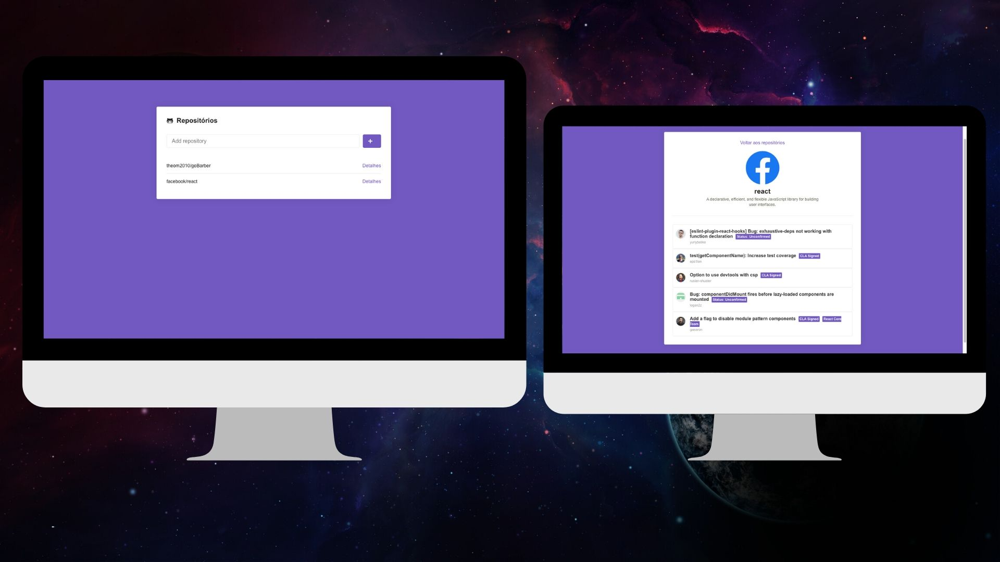

<h1 align="center">

</h1>

### Screenshot

------------

### Descrição

------------

###### GitHub User List um app onde é possível armazenar uma lista de repositórios do GitHub e ver os detalhes do mesmo.

### Tecnologias

------------
*Esse projeto foi desenvolvido com as seguintes tecnologias:*

- ###### Node.js
- ###### React

### Get Start

------------
##### `yarn start`

Runs the app in the development mode. 
Open [http://localhost:3000](http://localhost:3000) to view it in the browser.

The page will reload if you make edits. 
You will also see any lint errors in the console.

------------

 ###### Desenvolvido por Theo Menezes no BootCamp GoStack RocketSeat.
 

